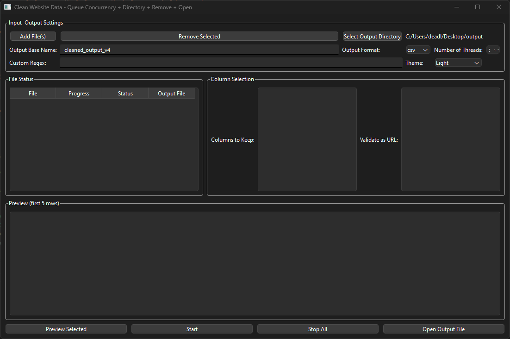
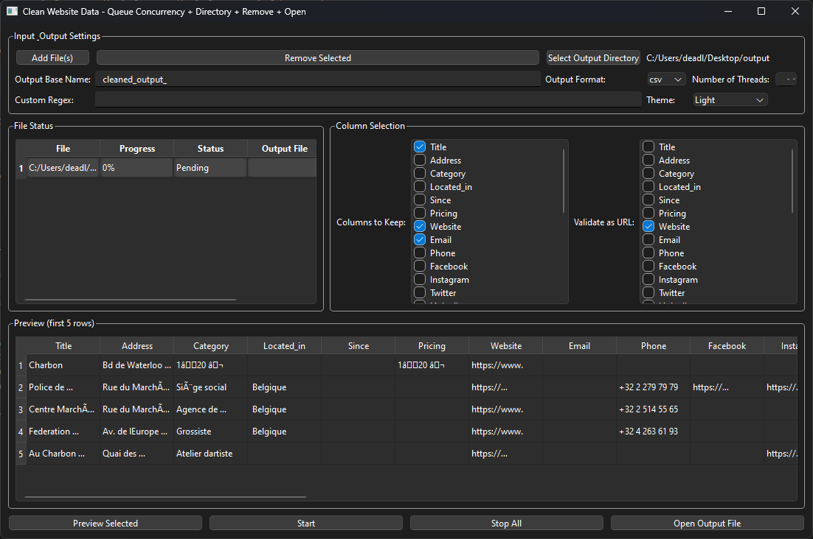

# Clean Website Data – PyQt6

A powerful, multi-feature **PyQt6** application that **cleans** and **validates** CSV/Excel files by:

- **Queue-Based Concurrency** (process multiple files in parallel)  
- **Chunked CSV Processing** (ideal for large datasets without freezing the UI)  
- **Configurable URL Validation** (default `validators.url` or custom regex)  
- **Drag & Drop** support (single or multiple files)  
- **Column Selection** with **Fuzzy Matching** (auto-detect “Title” / “Website” columns)  
- **Stop** button to cancel processing mid-run  
- **Output Directory** selection, plus “Open Output File” feature  
- **Dark / Light / High Contrast Themes** (switch at runtime)  
- **User Preferences** saved in `config.json` (threads, theme, last-used regex, etc.)

---

## Table of Contents

- [Clean Website Data – PyQt6](#clean-website-data--pyqt6)
  - [Table of Contents](#table-of-contents)
  - [Features](#features)
  - [Screenshots](#screenshots)
  - [Requirements](#requirements)
  - [Installation](#installation)
  - [Usage](#usage)
    - [Basic Run](#basic-run)
    - [Building an EXE (Windows)](#building-an-exe-windows)
  - [Configuration](#configuration)
  - [Project Structure](#project-structure)
  - [Contributing](#contributing)

---

## Features

1. **Queue Concurrency**  
   - Process multiple files simultaneously up to a user-defined thread limit (e.g., 4).  
   - When one file finishes, the next file in the queue starts automatically.

2. **Chunked CSV Reading**  
   - Prevents the GUI from freezing during large CSV operations by reading in chunks (e.g., 20,000 rows at a time).

3. **Validation**  
   - Uses [validators](https://pypi.org/project/validators/) for default URL checking.  
   - Optionally use a **custom regex** (e.g., `'^https?://.*'`).

4. **Column Selection & Fuzzy Matching**  
   - Auto-detect columns named “Title,” “Website,” etc., using [`rapidfuzz`](https://github.com/maxbachmann/rapidfuzz).  
   - Or fallback substring detection if `rapidfuzz` is not installed.

5. **Dark / Light / High Contrast Themes**  
   - Toggle theme at runtime from a dropdown; preferences persist in `config.json`.

6. **Drag & Drop**  
   - Drop CSV or XLSX files directly onto the app window to queue them.

7. **Stop Button**  
   - Cancel mid-process if you need to abort.

8. **Output Folder & Open File**  
   - Select a directory for saving cleaned output.  
   - Click **“Open Output File”** to launch the result in your default application.

---

## Screenshots





---

## Requirements

- **Python 3.7+**  
- The following Python libraries:
  - [PyQt6](https://pypi.org/project/PyQt6/)
  - [pandas](https://pypi.org/project/pandas/)
  - [validators](https://pypi.org/project/validators/)
  - [openpyxl](https://pypi.org/project/openpyxl/) (needed by pandas for Excel I/O)
  - [rapidfuzz](https://pypi.org/project/rapidfuzz/) (optional for advanced fuzzy matching; fallback substring check if not installed)

---

## Installation

1. **Clone or Download** this repository:
   ```bash
   git clone https://github.com/Deadlymind/clean_website_app.git
   cd clean_website_app
   ```

2. **Install Dependencies**:
   manually:
   ```bash
   pip install PyQt6 pandas validators openpyxl rapidfuzz
   ```

---

## Usage

### Basic Run

1. **Navigate** into the project folder:
   ```bash
   cd clean_website_app
   ```
2. **Run** the Python script:
   ```bash
   python clean_website_app.py
   ```
3. The **GUI** should appear. From there:
   - **Add Files** (or drag & drop).  
   - **Select Output Directory**.  
   - **Configure** the number of threads, custom regex, columns, etc.  
   - Press **“Start”** to begin processing.

### Building an EXE (Windows)

If you want a standalone `.exe` (no Python installation required for end-users):

1. Install [PyInstaller](https://pypi.org/project/pyinstaller/):
   ```bash
   pip install pyinstaller
   ```
2. Run:
   ```bash
   pyinstaller --onefile --noconsole clean_website_app.py
   ```
3. The resulting **`clean_website_app.exe`** will be in the **`dist/`** folder.

---

## Configuration

- The application reads and writes a **`config.json`** file in the same directory as the script (or EXE).  
- **User preferences** (theme, last used regex, window size, number of threads, etc.) persist between runs.  
- To reset or share default settings, you can delete `config.json` or commit a custom `config.json` to your repo (though typically it’s in `.gitignore`).

---

## Project Structure

Below is a **typical** structure. You may have more files or folders:

```
clean_website_app/
├─ clean_website_app.py        # Main PyQt6 script
├─ requirements.txt            # Dependencies
├─ README.md                   # Project documentation (this file!)
├─ .gitignore                  # Git ignore rules
├─ config.json                 # User config (often ignored)
├─ dist/                       # PyInstaller output (ignored)
├─ build/                      # PyInstaller build files (ignored)
└─ docs/                       # Screenshots, additional documentation
```

---

## Contributing

1. **Fork** the repository and **clone** it locally.  
2. Create a **feature branch** (`git checkout -b new-feature`).  
3. **Commit** your changes with clear messages.  
4. **Push** to your branch and create a **pull request**.  
5. We’ll discuss and merge as needed.

---

**Enjoy** your new “Clean Website Data” PyQt6 application! Feel free to explore advanced features like:

- **Localization** (`QTranslator`)  
- **Continuous Integration** (GitHub Actions)  
- **Installer Bundling** (Inno Setup, etc.)

Happy coding!
